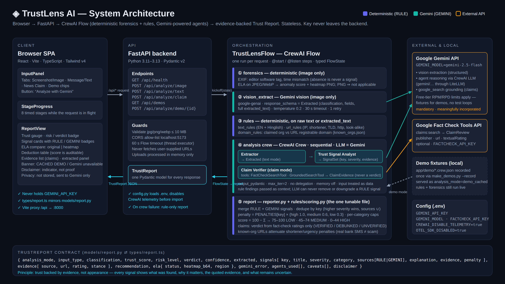

# TrustLens AI — See Beyond the Digital Surface

[](https://trustlens-ai-production-5b04.up.railway.app)


**Live:** https://trustlens-ai-production-5b04.up.railway.app

**Gemini-powered Trust Checker with two modes.** Upload an **image, video or audio clip, or paste text**, and choose what you are
verifying:

- **NEWS / CLAIM** — is the claim supported by available evidence, and is the media authentic and in context?
- **AI-GENERATED** — is this media likely synthetic or manipulated?

Every finding shows what was found, the quoted evidence, and whether it came from a deterministic **RULE**, from
**GEMINI**, from an external source, or from a specialist model (none is installed in this build, and reports say so).
Claim, media authenticity and context are answered separately, each with its own confidence.

> Trust should be backed by evidence, not appearance. *Don't just tell users what to trust. Show them why.*

Built at **ACM × MLH Hack Days 2026 — "Build with Gemini"**, Track 2: *Trust in a Synthetic World*.



## How Gemini is used

| Where | What Gemini does | How |
|---|---|---|
| Image, AI-Generated mode | Looks for visible signs of AI generation or editing, with where/what evidence and uncertainty | `google-genai`, structured output (`VisualAssessment`) |
| Image, News / Claim mode | Reads all text (OCR), extracts the claim, describes what is shown, and judges the image as media — one call | structured output (`NewsImageExtract`) |
| Video / audio | Transcribes speech, lists spoken claims and on-screen text, and reports timestamped observations | structured output (`MediaAssessment`) on sampled keyframes + the audio track |
| **Claim Verifier** agent | Decomposes the claim, searches, and reads each source headline's stance | CrewAI agent on Gemini + `NewsSearchTool`, `FactCheckSearchTool`, `GroundedSearchTool` |

Model: `GEMINI_MODEL` (default `gemini-3.6-flash`). Orchestration: a CrewAI **Flow** (`TrustLensFlow`):

```
preprocess (EXIF + ELA, or ffmpeg metadata + keyframes + audio) → Gemini examination → deterministic rules
→ claim verification crew (News / Claim) → per-dimension assessment in Python → report
```

Gemini never decides a state on its own: its observations are evidence, and the claim verdict, media state, context
state and confidence are computed in `services/reporter.py` and `services/fusion.py`.

The browser never talks to Gemini: Frontend → FastAPI → CrewAI/Gemini. The API key lives only in `backend/.env`.

## Run locally

```bash
# backend (Python 3.11–3.13)
cd backend
python3.12 -m venv .venv && source .venv/bin/activate
pip install -r requirements.txt
cp .env.example .env            # then set GEMINI_API_KEY (and optionally FACTCHECK_API_KEY)
python scripts/make_demos.py    # builds the demo images
python scripts/make_demos.py --record   # records real Gemini outputs for the demo chips (needs the key)
uvicorn app.main:app --reload --port 8000

# frontend
cd frontend
npm install
npm run dev                     # http://localhost:5173  (proxies /api → :8000)
```

### API

`POST /api/analyze` — multipart form: `mode` = `news_claim` | `ai_generated`, `file` = image (JPG/PNG/WebP ≤ 10 MB),
video (MP4/MOV/WebM ≤ 18 MB) or audio (MP3/WAV/M4A/OGG ≤ 18 MB), **or** `text` (≤ 8000 characters) instead of a file.
The file type is detected from its bytes.

```bash
curl -F mode=news_claim -F file=@clip.mp4 http://localhost:8000/api/analyze
```

Response (`TrustReport`, main fields):

```
mode, media_type, report_id
overall_assessment {state, label, summary, confidence, basis}
assessment_axes[]  {heading, state, label, summary, confidence, basis}   # one per question
claims[] {text, dimension, status, supporting, contradicting}            # News / Claim
evidence[] {source, url, title, published, stance, source_type, claim_index}
timeline[] {date, source, title, stance, url}
signals[] {key, title, severity, category, sources, explanation, evidence, uncertainty, penalty}
evidence_signals[] {signal_id, category, modality, source_type, model, finding, direction, confidence,
                    reliability, relevance, dimension, evidence, source_reference, limitations}
stages[] {name, status, detail}            # what actually ran
specialist_models[] {slot, task, status}   # MODEL_UNAVAILABLE in this build
media_metadata {…}, change_factors[], caveats[], notes[]
trust_score, risk_level, score_breakdown[], score_scope, verdict, recommendation, extracted, ela
```

Other endpoints: `GET /api/health` · `GET /api/demos` · `POST /api/analyze/demo/{id}` ·
`GET /api/reports/{report_id}` (only with a database) · `POST /api/report/pdf` (JSON `{"report": <TrustReport>}` → PDF).

Deploy: one container (`Dockerfile`) — FastAPI serves the built frontend; `railway.json` sets the health check.
Deployed on Railway: https://trustlens-ai-production-5b04.up.railway.app

## Modes

| Mode | Image | Video | Audio |
|---|---|---|---|
| **NEWS / CLAIM** | EXIF + ELA → Gemini OCR, claim extraction, visual and context check → source search → claim / media / context | ffmpeg metadata → keyframes + audio track → Gemini transcript, spoken claims, on-screen text, observations → source search → claim / visual / audio / A-V / context | ffmpeg metadata → Gemini transcript, spoken claims, voice observations → source search → claim / audio / context |
| **AI-GENERATED** | EXIF + ELA → Gemini visual examination → synthetic / manipulation assessment | ffmpeg metadata → keyframes + audio track → Gemini observations → visual / audio / A-V | ffmpeg metadata → Gemini voice observations → audio assessment |

Result states — News / Claim: `SUPPORTED`, `CONTRADICTED`, `MISLEADING_CONTEXT`, `UNVERIFIED`, `INCONCLUSIVE`,
`EVIDENCE_UNAVAILABLE`, `NOT_ASSESSED`. Media: `LIKELY_AUTHENTIC`, `LIKELY_SYNTHETIC`, `MANIPULATED`, `INCONCLUSIVE`.

How the dimensions stay separate:

- **Claim** is decided only from external sources: at least two independent listed sites, or one official source or
  fact-checker, on one side. Copies from one site count once. Sources on both sides → `INCONCLUSIVE` with both listed.
  A failed search → `EVIDENCE_UNAVAILABLE`, never "false". No claim in the file → `NOT_ASSESSED`, nothing is searched.
- **Media authenticity** is decided only from forensic findings and Gemini's observations of the file.
- **Context** combines the two: an apparently genuine file carrying a contradicted claim is `MISLEADING_CONTEXT`.
- **Confidence** is separate from the state and depends on what evidence was available. With no specialist detector,
  media confidence is `low` unless a measured forensic finding backs the state.
- In AI-Generated mode, text rules are not run and spoken claims are not fact-checked. Gemini is told not to judge
  truth from its own knowledge.
- Observations about a track the file does not have (a "presenter" in an audio-only file) are discarded in code.

Video: only up to 12 sampled frames (uniform + scene changes) and the audio track are sent to Gemini, so motion,
flicker and lip-sync between frames are not analysed. The report says this.

Specialist models (AI-image detector, video deepfake detector, anti-spoof audio model, OCR, ASR, embeddings, NLI) are
**not installed**: see [docs/MODEL_SELECTION.md](docs/MODEL_SELECTION.md) for the candidates, the evidence and why each
is deferred or rejected. Reports list each as `MODEL_UNAVAILABLE`; an unavailable model contributes nothing.

Text input: in News / Claim the pasted claim goes through the same source verification (claim assessment only, no
media axes). In AI-Generated mode Gemini lists quoted traits of AI-style writing; the state is decided in code, needs
about 40 words, requires at least two quoted traits that really occur in the text, and always carries low confidence,
because AI-text detection is unreliable. No AI-text detector model is installed.

## Storage

Optional PostgreSQL (`DATABASE_URL`, set on Railway). It stores the finished report JSON only — never the uploaded
file — so an identical file in the same mode returns the same report after a restart (news reports are re-run after
24 h), and a report can be reopened with `GET /api/reports/{report_id}`. There is no endpoint that lists reports.
Without a database the app works the same from a 30-minute in-memory cache.

## PDF Trust Report

After any analysis, **Generate PDF Report** downloads `TrustLens_Report_<timestamp>.pdf`
(sample: [docs/sample_trust_report.pdf](docs/sample_trust_report.pdf)).

```
Trust Report (already on screen) → POST /api/report/pdf → wording → ReportLab (in memory) → PDF download
```

- The analysis is the source of truth. Nothing is re-analysed; the endpoint re-derives the score from the posted
  signals with the real scoring code and refuses a report whose score or risk level does not match.
- **Default wording ("direct")**: built deterministically from the TrustLens/Gemini analysis. No extra model, no key.
- **Optional wording layer (OpenRouter)**: set `OPENROUTER_API_KEY` and `OPENROUTER_REPORT_MODEL` to a **free**
  model id (must end with `:free`; a paid id is never called). The model only rewrites the summary and
  explanations. Score, risk level, verdict, the signal list with severity and RULE/GEMINI source, recommendation and
  verification steps are copied from the analysis afterwards, whatever the model returned. Over-claims ("definitely
  fake"), URLs that are not in the analysis, malformed JSON, timeouts or an unavailable model all fall back to the
  direct wording. The PDF footer states which wording was used.
- Keys stay on the server; the PDF is built in memory and never stored.
- The built-in PDF fonts are Latin-only: text in other scripts is shown as `[non-Latin text]`.
- Railway variables (optional): `OPENROUTER_API_KEY`, `OPENROUTER_REPORT_MODEL`.
- Tests: `python tests/test_report_pdf.py` (OpenRouter mocked) and `python tests/score_eval.py`.

## Trust score — auditable by design

The 0–100 number is a **risk indicator for the content**, shown beside the per-question assessments, not instead of
them. In AI-Generated mode it counts forensic and visual/audio indicators only; in News / Claim mode it counts content
risk signals and sources contradicting the claim. It does not measure whether a claim is true. This is relevance
gating written as explicit rules, not a learned or calibrated fusion model.

Start at 100. Each de-duplicated signal subtracts `PENALTIES[key] × severity` (high 1.0 · medium 0.6 · low 0.3).
Deductions are capped per category (image forensics 25 · URL/domain 30 · message content 60 · claim evidence 40).
Bands: **75–100 LOW · 45–74 MEDIUM · 0–44 HIGH**. Everything is in one file: `backend/app/rules/scoring.py`.
The report shows the full deduction table, so the number can be checked by hand.

The same signal found by a rule *and* by Gemini counts once and shows both badges.

**The Trust Score is a risk indicator, not proof of authenticity or fraud.**

## Honesty & limits

- **Score and verdict are computed in Python, never by the model.** Gemini can add signals or raise severity; it can
  never remove or downgrade a rule finding.
- **UNVERIFIED is a first-class answer.** A claim is `VERIFIED/DEBUNKED BY SOURCE` only when a fact-check outlet with an
  explicit rating says so, and only for links that actually came from a search tool.
- **Prompt-injection guard.** Content is wrapped as data in every prompt; text addressed to an AI is itself reported as a
  high-severity "Prompt injection attempt" signal.
- **ELA and EXIF are signals, not proof.** ELA runs only on JPEG/WebP (PNG ⇒ "not applicable"); missing EXIF is never a signal.
- **A clean fake passes.** LOW is shown as "No risk signals found — not verified as authentic", never as "safe".
- **Known-organisation attenuation.** If every link is on the claimed organisation's own domain, urgency is capped at
  low, so a real bank SMS is not flagged HIGH for sounding urgent.
- **Graceful degradation.** If Gemini is unavailable, the report still returns rule + forensics signals with a banner; nothing is fabricated.
- **Repeatable.** Gemini runs at temperature 0, and an identical input is answered from a short-lived in-memory cache (30 min, RAM only), so the same image gives the same report.
- **Privacy.** Images are processed in memory. Video and audio are written to a private temporary folder for ffmpeg and deleted when the request ends. Files are sent to Gemini for analysis. Only the report JSON may be stored (see Storage).
- **Not a truth detector.** TrustLens reports likelihood, evidence, uncertainty and limits. It does not claim guaranteed detection of deepfakes or AI-generated media.
- Rules cover English + Hinglish patterns; other languages rely on Gemini.

## Track 2 mapping

- **Detect** — manipulated images: EXIF editor traces + multi-quality Error Level Analysis with a heatmap.
- **Verify** — notices, offer letters and documents: Gemini vision extraction + inconsistency analysis.
- **Trace** — viral claims: fact-check search + Google-Search grounding with source links.
- **Secure** — phishing/scam messages: URL, domain-mismatch and impersonation rules against ~30 known organisations.
- **Build Trust** — transparent, evidence-backed AI: source badges, quoted evidence, auditable score, honest caveats.

## Demos

`Genuine notice` · `Edited notice` (AI-Generated mode) · `Viral post` (News / Claim mode). The chips run forensics live
and use pre-recorded Gemini output (`backend/app/demo/*.ai.json`, `*.news.json`, badge **CACHED DEMO**). Anything you
upload yourself is analysed live. The demo notice uses a fictional institution.

## Tests

```bash
cd backend
python tests/test_modes.py      # 25 checks: both modes x image/video/audio, failure handling (Gemini mocked)
python tests/score_eval.py      # text rules, 50 labelled messages
python tests/score_holdout.py   # text rules, 30 held-out messages
python tests/test_report_pdf.py
```

## Stack

React + Vite + TypeScript + Tailwind v4 · FastAPI + Pydantic v2 · CrewAI (Flow + sequential Crew) · google-genai ·
Pillow / piexif / NumPy · ffmpeg (bundled via `imageio-ffmpeg`) · optional PostgreSQL (`psycopg`) · no auth.

Planning docs: `architecture.md`, `design.md`, `memory.md`, `content_kit.md`.
