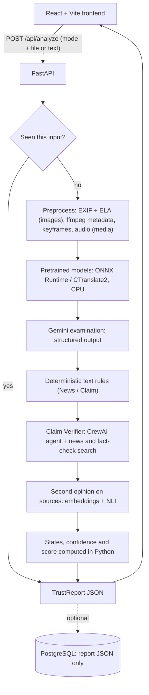

# TrustLens AI

**See beyond the digital surface.** TrustLens analyses an image, video, audio clip or piece of text and returns an
evidence-backed report instead of a single "real / fake" label.

<p align="center">
  <!-- Project -->
  <a href="https://trustlens-ai-production-5b04.up.railway.app"></a>
  
  
</p>
<p align="center">
  <!-- AI and models -->
  
  
  
  
</p>
<p align="center">
  <!-- Backend -->
  
  
  
  
  
</p>
<p align="center">
  <!-- Frontend -->
  
  
  
  
</p>
<p align="center">
  <!-- Deployment -->
  
  
</p>

**Live:** https://trustlens-ai-production-5b04.up.railway.app

Built at **ACM × MLH Hack Days 2026 — "Build with Gemini"**, Track 2: *Trust in a Synthetic World*.

> TrustLens is not a truth detector. It reports likelihood, the evidence behind it, how confident that evidence makes
> it, and what it could not check. Read [Known limitations](#known-limitations) before relying on a result.

## Contents

- [What it does](#what-it-does)
- [Quick start](#quick-start)
- [Architecture](#architecture)
- [How a result is decided](#how-a-result-is-decided)
- [Models](#models)
- [API](#api)
- [Configuration](#configuration)
- [Project layout](#project-layout)
- [Testing](#testing)
- [Deployment](#deployment)
- [Privacy and data handling](#privacy-and-data-handling)
- [Known limitations](#known-limitations)
- [Further documentation](#further-documentation)

## What it does

You pick one of two modes, then upload a file or paste text.

| Mode | Question it answers | Inputs |
|---|---|---|
| **News / Claim** | Is the claim supported by available evidence, and is the media authentic and used in context? | image, video, audio, text |
| **AI-Generated** | Is this media (or text) likely synthetic or manipulated? | image, video, audio, text |

The two modes are deliberately separate. An authentic photo can carry a false claim, and an AI-generated image can
accompany a true one, so a News / Claim report gives three independent answers — **claim**, **media authenticity**,
**context consistency** — each with its own state and confidence. AI-Generated mode examines only the media itself and
does not fact-check what is said in it.

Every finding states what was found, the quoted evidence, and where it came from: a deterministic **RULE**, **GEMINI**,
a pretrained **MODEL**, or an **external source**. Reports also list the pipeline stages as they actually ran, what
each model did, and what would change the assessment.

## Quick start

Requirements: Python 3.10–3.13 (developed on 3.12) and Node `^20.19` or `>=22.12`. A system ffmpeg is optional; a
bundled binary is used if none is on `PATH`.

```bash
# terminal 1 — backend
cd backend
python3.12 -m venv .venv && source .venv/bin/activate
pip install -r requirements.txt
cp .env.example .env              # set GEMINI_API_KEY
python scripts/fetch_models.py    # optional: ~0.9 GB of pretrained weights into backend/models
uvicorn app.main:app --reload --port 8000
```

```bash
# terminal 2 — frontend
cd frontend
npm install
npm run dev                       # http://localhost:5173, proxies /api to :8000
```

Without `GEMINI_API_KEY` the app still starts and returns deterministic and model-only results, flagged as degraded.
Without `fetch_models.py` every model except OCR reports `MODEL_UNAVAILABLE` and Gemini does that job instead; weights
are never downloaded at request time.

Try it from the command line:

```bash
curl -F mode=news_claim -F file=@clip.mp4 http://localhost:8000/api/analyze
curl -F mode=ai_generated -F "text=Paste at least forty words here ..." http://localhost:8000/api/analyze
```

## Architecture

One container serves both the API and the built frontend. The browser never talks to Gemini.



| Layer | Technology | Where |
|---|---|---|
| Frontend | React 19, Vite 8, TypeScript 6, Tailwind CSS 4 | `frontend/src` |
| API | FastAPI, Pydantic v2 | `backend/app/routes` |
| Orchestration | CrewAI Flow (`TrustLensFlow`) | `backend/app/services/flow.py` |
| LLM | Gemini via `google-genai` (structured output) and CrewAI | `services/gemini_*.py`, `services/crew` |
| Pretrained models | ONNX Runtime, CTranslate2 (no PyTorch) | `backend/app/ml` |
| Deterministic checks | Pillow, piexif, NumPy, ffmpeg, regex rules | `services/image_forensics.py`, `services/media`, `rules` |
| Assessment | Plain Python | `services/reporter.py`, `services/fusion.py` |
| Storage | In-memory cache; optional PostgreSQL (`psycopg`) | `services/result_cache.py`, `services/store.py` |
| PDF | ReportLab | `services/pdf_report_service.py` |

### Pipeline by mode and input

| | Image | Video | Audio | Text |
|---|---|---|---|---|
| **News / Claim** | EXIF, ELA → image detector, OCR → Gemini reads text, claim and image → rules → source search → embeddings + NLI | ffmpeg metadata, ≤ 12 keyframes, audio → frame detector, speech detector, Whisper → Gemini transcript, claims, observations → rules → source search → embeddings + NLI | ffmpeg metadata → speech detector, Whisper → Gemini → rules → source search → embeddings + NLI | rules → source search → embeddings + NLI |
| **AI-Generated** | EXIF, ELA → image detector → Gemini visual examination | ffmpeg metadata, keyframes, audio → frame detector, speech detector, Whisper → Gemini observations | ffmpeg metadata → speech detector, Whisper → Gemini observations | Gemini reads the writing style |

Source search uses Google News RSS, the Google Fact Check Tools API (only when `FACTCHECK_API_KEY` is set) and Gemini
search grounding. Every URL a tool returns is recorded in a ledger; an evidence item whose URL is not in that ledger is
dropped, so the model cannot invent a source.

## How a result is decided

Gemini and the models produce evidence. **States, confidence, score and verdict are computed in Python**, in
`services/reporter.py` and `services/fusion.py`.

**Claim** (News / Claim)
- Only sources on the tier list (`rules/source_registry.json`: official, wire, established, fact-checker) count.
- A side needs two independent sources, or one official source or fact-checker. Independence is by registrable domain,
  so five articles from one site count once.
- Before the verdict, a multilingual NLI model reads each headline against the claim. If it strongly disagrees with
  Gemini's reading (score ≥ 0.8), that source is set aside and counts for neither side. A headline the embedding model
  finds off-topic (similarity < 0.2) is also set aside.
- States: `SUPPORTED`, `CONTRADICTED`, `INCONCLUSIVE` (sources conflict), `UNVERIFIED` (nothing settles it),
  `EVIDENCE_UNAVAILABLE` (the search failed — never treated as "false"), `NOT_ASSESSED` (no checkable claim found).

**Media authenticity** (both modes)
- Image: `MANIPULATED` if error-level analysis finds a strong localised anomaly. Otherwise the pretrained detector's
  score and Gemini's visual indicators are compared. Agreement gives `LIKELY_SYNTHETIC` or `LIKELY_AUTHENTIC`;
  disagreement gives `INCONCLUSIVE` ("Evidence conflicts") with both shown.
- The image detector is trained on photographs. For screenshots, documents and text-heavy graphics its score is shown
  and not used.
- Video: the same detector scores each sampled keyframe; the visual axis reacts when at least half of the frames (and
  at least two) score high.
- Audio: the speech detector is reported as weak evidence only and never decides the state.

**Context consistency** (News / Claim with media): an apparently genuine file carrying a contradicted claim is
`MISLEADING_CONTEXT`.

**AI-written text**: needs about 40 words and at least two quoted traits that really occur in the text. Confidence is
always low; no AI-text detector model is used.

**Confidence** is separate from the state. Media confidence is `medium` only when a pretrained detector and Gemini
agree, or a measured forensic finding backs the state; otherwise `low`. It is never `high`.

**The 0–100 number** is a risk indicator for the content, shown beside the per-question states, not instead of them.
Start at 100; each de-duplicated signal subtracts `PENALTIES[key] × severity` (high 1.0, medium 0.6, low 0.3), capped
per category (image forensics 60, visual analysis 70, URL/domain 30, message content 60, claim evidence 60). Bands:
75–100 low, 45–74 medium, 0–44 high; a high-severity signal is never shown as low risk. Everything is in
`rules/scoring.py`, and the report prints the full deduction table. This is explicit rules, not a learned or
calibrated model, and it does not measure whether a claim is true.

The weights are sized so the number agrees with the assessment beside it:

| Finding | Deduction | Typical result |
|---|---|---|
| Edited region found by error-level analysis | 50 | high risk |
| Strong AI-generation indicators (Gemini and/or the detector) | 60 | high risk |
| Claim contradicted by sources | 60 | high risk |
| Claim that no listed source settles | 30 | medium risk, never a clean score |
| Nothing found and a positive assessment | 0 | 100, low risk |

When the result is undecided and there are no findings at all (for example a video with no checkable claim and no
indicators), the interface shows **"Not scored"** instead of 100, because a clean number would read as "trusted".
The API still returns `trust_score`; use `overall_assessment.state` to tell the two cases apart.

Bundled demos: Genuine notice 100 (likely authentic), Edited notice 40 (manipulated), Viral post 40 (misleading
context).

**Safeguards**
- All user content is passed to Gemini as data. Text addressed to an AI ("ignore previous instructions…") is itself
  reported as a high-severity prompt-injection signal.
- Gemini can add findings or raise severity. It cannot remove or downgrade a rule finding, and it cannot report a
  forensic measurement it did not make.
- Observations about a track the file does not have (a "presenter" in an audio-only file) are discarded in code.
- If Gemini fails or a request times out, the API still returns HTTP 200 with the deterministic and model evidence,
  marked `gemini_error`. Nothing is filled in.

## Models

All models run on CPU through ONNX Runtime or CTranslate2. Weights are fetched once by `scripts/fetch_models.py` (at
Docker build, or manually for local use) into `backend/models/`, loaded lazily, and unloaded to stay under the
container's memory limit. A model that cannot load reports `MODEL_UNAVAILABLE`, and Gemini covers that task.

| Slot | Model | Used for | Effect on the result |
|---|---|---|---|
| AI-image detector | [Community Forensics ViT](https://huggingface.co/buildborderless/CommunityForensics-DeepfakeDet-ViT) (ONNX) | Images, and each sampled video frame | Adds a finding at score ≥ 0.7; decides or conflicts with Gemini at ≥ 0.85 / ≤ 0.15 |
| Speech detector | [wav2vec2 deepfake-audio](https://huggingface.co/ai8shiro/deepfake-audio-wav2vec2-ONNX) (ONNX) | Audio tracks | Weak evidence only: low-severity finding at ≥ 0.85 |
| Transcription | [Whisper base](https://huggingface.co/Systran/faster-whisper-base) (faster-whisper, int8, VAD) | Audio tracks, first 75 s | Transcript when Gemini fails; agreement check when it does not |
| OCR | RapidOCR (PP-OCR, bundled in the package) | News / Claim images | Text when Gemini fails; agreement check; decides whether the image detector applies |
| Relevance | [paraphrase-multilingual-MiniLM-L12-v2](https://huggingface.co/Xenova/paraphrase-multilingual-MiniLM-L12-v2) (ONNX, int8) | Each source headline vs the claim | Off-topic sources are set aside |
| NLI | [multilingual MiniLMv2 NLI](https://huggingface.co/onnx-community/multilingual-MiniLMv2-L6-mnli-xnli-ONNX) (ONNX, int8) | Each source headline vs the claim | Sources it reads the opposite way are set aside; lowers claim confidence when it corroborates none |
| AI-text detector | none | — | Always `MODEL_UNAVAILABLE`; Gemini reads the style |

`GET /api/models/selftest` loads each model and runs it on a bundled input, so "available" means inference actually
succeeded. On the current deployment (a 1 GB container, checked 1 Oct 2026) five models run; the **speech detector
does not fit in memory and reports `MODEL_UNAVAILABLE`**.

None of these models has been evaluated by this project on a labelled test set. Candidates, published evidence and
why each was chosen or rejected: [docs/MODEL_SELECTION.md](docs/MODEL_SELECTION.md).

## API

All routes are under `/api`. Errors use FastAPI's default body, `{"detail": "..."}`. Every response carries
`X-Request-ID` and `X-Response-Time`. There is no authentication and no rate limiting.

| Method | Path | Purpose |
|---|---|---|
| `POST` | `/api/analyze` | Run an analysis. Multipart: `mode` (`news_claim` \| `ai_generated`) plus `file` **or** `text` |
| `GET` | `/api/reports/{report_id}` | Reopen a stored report (needs a database) |
| `GET` | `/api/demos` | List the bundled demos |
| `GET` | `/api/demos/{id}/image` | Demo image |
| `POST` | `/api/analyze/demo/{id}` | Run a demo with recorded Gemini output |
| `POST` | `/api/report/pdf` | Build a PDF from a posted `{"report": TrustReport}` |
| `GET` | `/api/models` | Which models are installed (loads nothing) |
| `GET` | `/api/models/selftest` | Load and run every model on bundled inputs (`?fresh=true` to re-run) |
| `GET` | `/api/health` | Configuration status |

`POST /api/analyze` limits: images (JPEG, PNG, WebP) 10 MB; video (MP4, MOV, WebM) and audio (MP3, WAV, M4A, OGG)
18 MB; text 8,000 characters. The file type is detected from the file's bytes, not its name. Status codes: `413` too
large, `415` unsupported type, `422` nothing to analyse or invalid mode. A Gemini failure is **not** an error status.

Full request and response reference: [docs/API_REFERENCE.md](docs/API_REFERENCE.md).

## Configuration

Set in `backend/.env` locally (see `.env.example`) or as service variables in production.

| Variable | Default | Purpose |
|---|---|---|
| `GEMINI_API_KEY` | — | Needed for full analysis. Without it results are deterministic and model-only |
| `GEMINI_MODEL` | `gemini-3.6-flash` | Model for every Gemini call |
| `FACTCHECK_API_KEY` | — | Enables Google Fact Check Tools lookups |
| `DATABASE_URL` | — | PostgreSQL for stored reports |
| `OPENROUTER_API_KEY`, `OPENROUTER_REPORT_MODEL` | — | Optional PDF wording layer. The model id must end with `:free` |
| `TRUSTLENS_ML` | `1` | Set `0` to switch all pretrained models off |
| `TRUSTLENS_MODEL_DIR` | `backend/models` | Where model weights live |
| `MAX_UPLOAD_MB` | `10` | Image upload cap |
| `LLM_TIMEOUT_S` / `FLOW_TIMEOUT_S` | `30` / `60` | Per-call and default per-request timeouts |
| `DEBUG` | `false` | Verbose logging |
| `PORT` | `8000` | Listening port in the container |

Per-request time limits: 60 s for AI-Generated images and text, 120 s for News / Claim images and text, 180 s and
240 s for video and audio.

## Project layout

```
backend/
  app/
    routes/        analyze, demos, report (PDF), models, health
    services/      flow.py (pipeline), reporter.py + fusion.py (assessment), specialists.py (model runs),
                   gemini_*.py, crew/ (CrewAI agent, tasks, tools), news/, media/probe.py (ffmpeg),
                   image_forensics.py, store.py, result_cache.py, pdf_report_service.py
    ml/            registry.py (slots, memory guard), models.py (loaders and inference)
    rules/         scoring.py, text_rules.py, url_rules.py, domain_rules.py, source_registry.json
    models/        Pydantic schemas: report.py, evidence.py, llm_outputs.py
    demo/          demo images and recorded Gemini output
  scripts/         fetch_models.py, make_demos.py
  tests/
frontend/src/      pages/Home.tsx, components/, hooks/, services/api.ts, types/report.ts
docs/              API_REFERENCE.md, DEPLOYMENT.md, MODEL_SELECTION.md
Dockerfile         two stages: frontend build, then Python runtime + model weights
railway.json       Dockerfile builder and health check
```

## Testing

```bash
cd backend && source .venv/bin/activate
python tests/test_modes.py        # 41 checks: both modes x image/video/audio/text, model-to-assessment wiring, failures
python tests/score_eval.py        # text rules on 50 labelled messages
python tests/score_holdout.py     # text rules on 30 held-out messages
python tests/test_report_pdf.py   # PDF endpoint (needs: pip install pypdfium2)
pytest tests/test_pipeline_resilience.py tests/test_url_validator.py   # needs: pip install pytest
```

```bash
cd frontend
npm run build    # type-check + production build
npm run lint
```

`test_modes.py` mocks Gemini, the search step and model inference. It proves routing, the separation of the three
answers, conflict and failure handling, and that a model's output changes the assessment. It does not measure how
accurate Gemini or the models are. There is no CI configuration and no frontend test suite.

## Deployment

The repository deploys as a single Docker container: stage one builds the frontend, stage two installs the backend,
downloads the model weights, and serves both. `railway.json` selects the Dockerfile builder and sets the health check
to `/api/health`.

```bash
docker build -t trustlens-ai .
docker run -p 8000:8000 -e GEMINI_API_KEY=... trustlens-ai
```

On Railway: set `GEMINI_API_KEY`, optionally add a PostgreSQL service and set
`DATABASE_URL=${{Postgres.DATABASE_URL}}`, then `railway up`.

Sizing: all models loaded together need roughly 2 GB. On a 1 GB container the app runs, but models are loaded one at a
time and the speech detector is skipped. Details: [docs/DEPLOYMENT.md](docs/DEPLOYMENT.md).

## Privacy and data handling

- Uploaded files and pasted text are sent to Google's Gemini API for analysis.
- Images are processed in memory. Video and audio are written to a private temporary directory for ffmpeg and deleted
  when the request ends. Uploads are never stored.
- Finished reports are cached in memory for 30 minutes. If `DATABASE_URL` is set, the report JSON — which includes
  text extracted from the upload — is stored so the same input returns the same report and a report can be reopened
  by its id. News / Claim reports are re-run after 24 hours. There is no endpoint that lists reports, and nothing
  deletes them automatically.
- Report ids are random but unauthenticated: anyone with an id can read that report.
- The frontend loads fonts from Google Fonts.

## Known limitations

- **Unvalidated models.** No model here has been measured by this project on labelled real and fake samples. Published
  results for detectors of this kind drop sharply on real-world data.
- **Weak pieces.** The speech detector was trained on replay attacks, not modern voice cloning. The NLI model often
  reads fact-check headlines as "neutral", so it rarely corroborates. OCR reads Latin and Chinese script only.
- **Video.** At most 12 still frames are examined. Motion, flicker, lip-sync and face-swap deepfakes are not analysed.
- **Claims.** Stance is read from headlines, not article bodies. A claim nobody has written about comes back
  `UNVERIFIED`, which says nothing about whether it is true.
- **AI-written text.** Detection from style alone is unreliable and always reported with low confidence.
- **Quota.** On Gemini's free tier the daily request limit is small and counted per model. When it runs out the
  API answers `429`, and results degrade to deterministic and model-only evidence with `gemini_error` set and no
  score shown. The fix is a key with remaining quota or a different `GEMINI_MODEL`; there is no automatic fallback.
- **Languages.** Text rules cover English and Hinglish patterns. Other languages depend on Gemini.
- **Operations.** No authentication, rate limiting, CI or licence file. The in-memory cache is per process, so more
  than one replica would give inconsistent cache hits.

## Further documentation

| Document | Contents |
|---|---|
| [docs/API_REFERENCE.md](docs/API_REFERENCE.md) | Every endpoint, the `TrustReport` schema, error codes |
| [docs/MODEL_SELECTION.md](docs/MODEL_SELECTION.md) | Installed models, candidates considered, evidence and limits |
| [docs/DEPLOYMENT.md](docs/DEPLOYMENT.md) | Docker and Railway deployment, variables, sizing |
| [CONTRIBUTING.md](CONTRIBUTING.md) | Local setup, tests, conventions |
| [docs/sample_trust_report.pdf](docs/sample_trust_report.pdf) | A sample PDF report |
